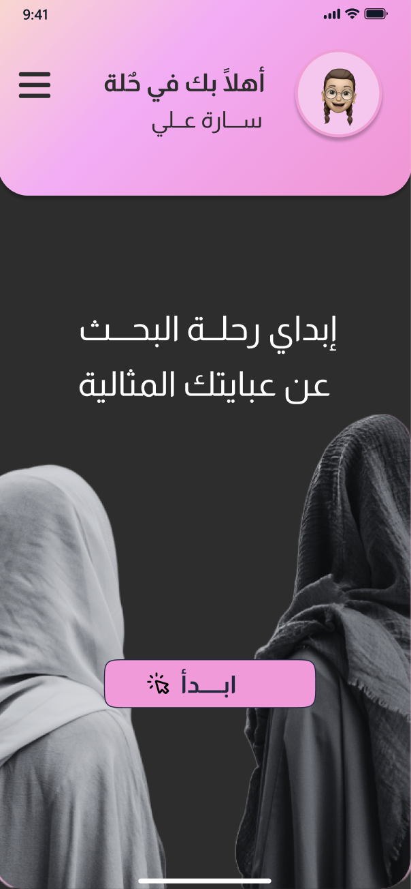
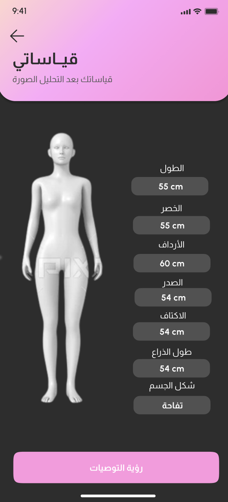
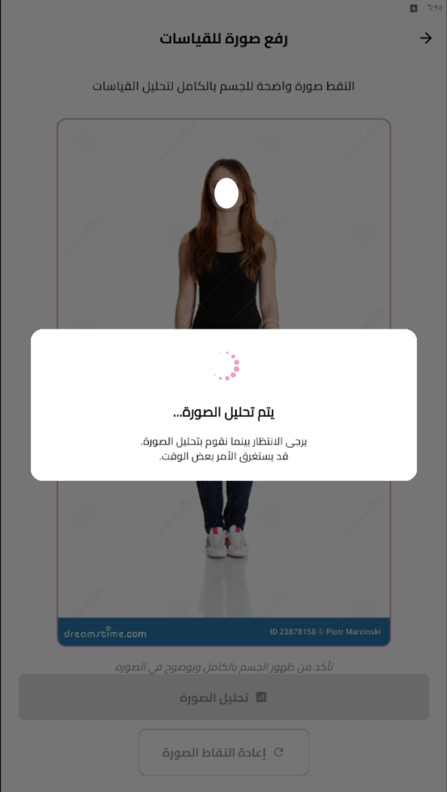
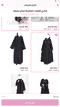
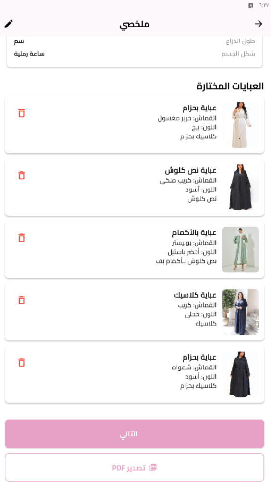

# Hullah – AI-Powered Abaya Recommendation App

> **Hullah** (Arabic: حُلّة — "elegant attire") is an AI-powered mobile application that helps women find abaya styles that truly fit their body shape, using either manual measurements or a single front-facing photo.

> 📌 **Note:** This repository does not contain the project's source code, datasets, or any backend/frontend implementation files. See [`NOTICE.md`](NOTICE.md) for details.

---

## 📖 Overview

Abaya is one of the most widely worn garments by women in Saudi Arabia and the Gulf region, yet finding one that matches an individual's body shape — especially when shopping online — remains a common challenge. Standardized sizing rarely reflects the diversity of real body proportions, leading to poor fit, frequent returns, and costly tailoring.

**Hullah** addresses this gap by combining computer vision, machine learning, and a curated catalog of real-world abaya designs to deliver **personalized, body-aware abaya recommendations**.

For more details, see [`docs/project-overview.md`](docs/project-overview.md).

---

## ❓ Problem Statement

Many women struggle to find abayas that suit their body shape due to limited sizing options and the absence of intelligent, body-aware recommendation tools in the market. This leads to discomfort, dissatisfaction, and added costs from alterations or returns.

Read more in [`docs/problem-statement.md`](docs/problem-statement.md).

---

## ✨ Key Features

- 📏 **Manual or Image-Based Measurement Input** — users can either enter measurements manually or upload a front-facing photo.
- 🤖 **AI-Powered Body Analysis** — pose estimation extracts body keypoints and converts pixel measurements into centimeters.
- 👗 **Body Shape Classification** — classifies users into one of five body shapes (Hourglass, Pear, Apple, Rectangle, Inverted Triangle).
- 🛍️ **Personalized Abaya Recommendations** — suggests styles from a curated catalog based on the detected body shape.
- 📄 **Exportable Summary Report** — generates a downloadable/printable summary of measurements and recommendations to share with a tailor or designer.
- 🔒 **Privacy-Conscious Design** — only extracted measurements are stored; uploaded photos are not retained.

Full feature breakdown in [`docs/features.md`](docs/features.md).

## Screenshots

| Home | Measurements | Analysis Loading |
|---|---|---|
|  |  |  |

| Abaya Selection | Final Summary |
|---|---|
|  |  |

---

## 🏗️ System Architecture (High Level)

Hullah follows a **3-layer architecture**:

1. **Frontend** — a mobile application interface for measurement input, recommendations, and report export.
2. **Backend** — an API layer that handles requests, image processing orchestration, and data storage.
3. **AI Layer** — pose estimation and machine learning models for measurement extraction, body shape classification, and girth prediction.

A high-level overview of the technologies and architecture is available in [`docs/system-architecture.md`](docs/system-architecture.md).

---

## 🧭 Methodology

The project followed an **Iterative Waterfall Model**, progressing through Requirements & Analysis, Design, Development, Testing, and Maintenance phases.

See [`docs/methodology.md`](docs/methodology.md) for the full development process.

---

## 📊 Results & Evaluation

The AI models and application were evaluated through unit testing, AI model performance metrics (precision, recall, F1-score, MAE), and usability testing with real participants — all showing strong performance and a positive user experience.

See [`docs/results.md`](docs/results.md) for the full results summary.

---

## 📄 License & Usage

This repository is shared for **academic and portfolio purposes only**. Please see [`NOTICE.md`](NOTICE.md) for details on usage and source code availability.
